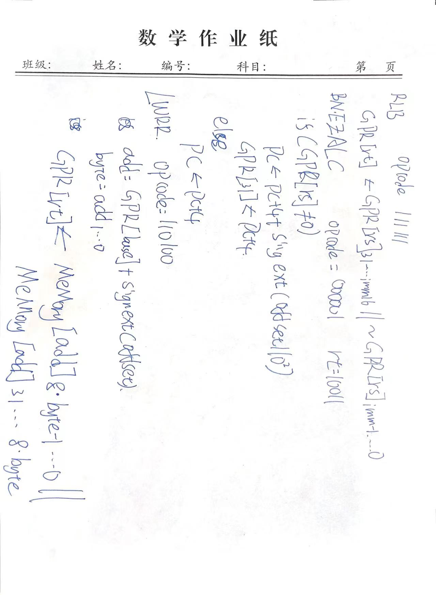

# p4(别人做的,不是我做的)

## 第一题

- RLB命令： opcode：111111
- GPR[rt] <------ GPR[rs]31....imm16 || ~GPR[rs]imm-1.......0;


## 第二题

- BNEZALC命令：opcode：000001， rt = 10011（固定）

  ```verilog
  if (GPR[rs] != 0)
  	PC <--- PC + 4 + sign_ext(offset || 0^2)
  	GPR[31] <===== PC + 4
  else 
  	PC <---- PC + 4
  ```

  

## 第三题

- LWRR： opcode = 110100

  ```verilog
  addr = GPR[base] + sign_ext(offset)
  byte = addr1...0
  GPR[rt] <----- Mem[addr]8*byte-1...0 || Mem[add]31...8*byte
  ```


