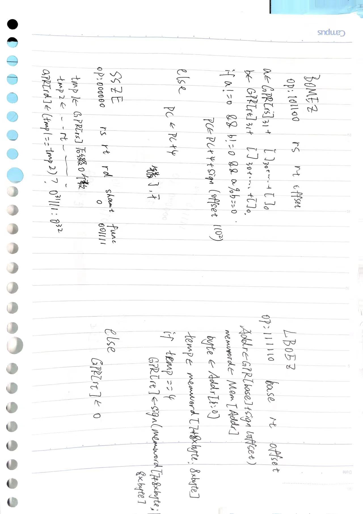

# p4我做的

**注意:** 你打包上传的是一堆.v文件，到时候新建一个文件后，要将.v复制到文件夹里面，然后通过add source将.v加入project中；如果你把.v放在文件夹外面，然后就直接add source，这些.v会变成一个文件，这玩意儿是交不上去的。**切记！！！！！！！，我浪费了20分钟在这上面**

- 其实p4就是可以按照p3的思路直接在datapath改，然后看着logisim的电路加线即可。

**P.S.** 以后木得提前题了，周围大佬都挂p5了，**一定要好好准备p5！！！！！**