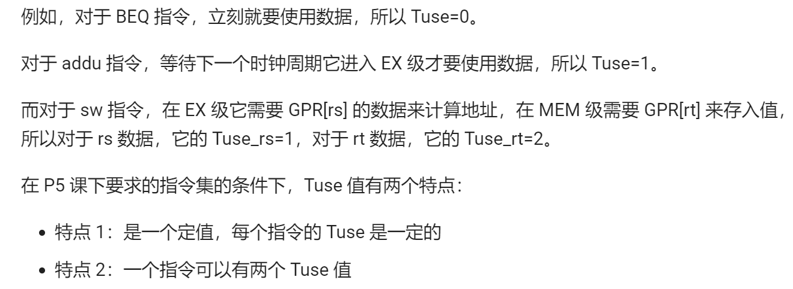
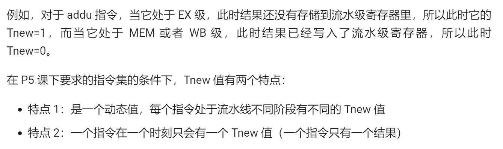
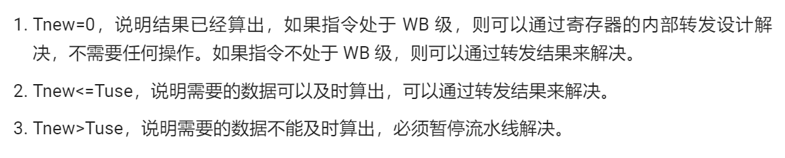
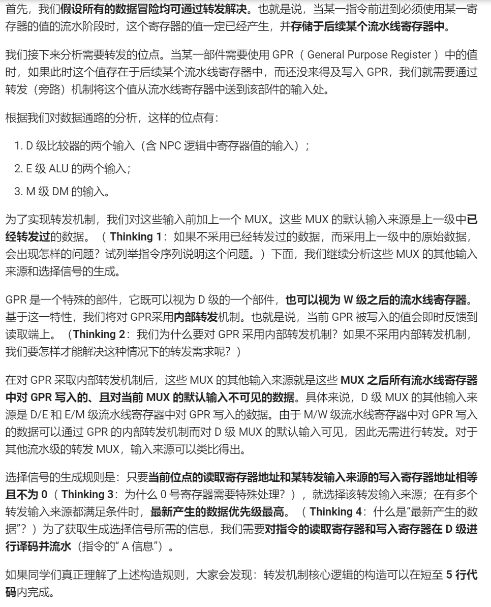
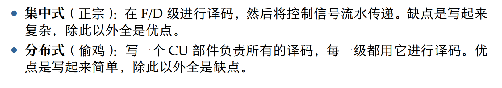

# P5注意加疑惑

## 一、为什么jal和jalr是PC + 8？

- 因为，jal和jalr后一步会是延迟槽，是必做的一步，所以jr跳回来的是jal和jalr后两步的地方，因此jal和jalr存入RF中的PC+8

## 二、控制与冒险简述

- 对于控制冒险，本实验要求大家实现**比较过程前移至 D 级**，并**采用延迟槽**。

- 对于数据冒险，两大策略及其应用：

  ```markdown
  假设当前我需要的数据，其实已经计算出来，只是还没有进入寄存器堆，那么我们可以用**转发**( Forwarding )来解决，即不引用寄存器堆的值，而是直接从后面的流水级的供给者把计算结果发送到前面流水级的需求者来引用。如果我们需要的数据还没有算出来。则我们就只能**暂停**( Stall )，让流水线停止工作，等到我们需要的数据计算完毕，再开始下面的工作。
  ```

  ## 三、如何判断所需数据是否已经算出来了？**需求时间——供给时间模型**

  

  - **Tuse**（对于数据需求）：这条指令位于 D 级的时候，再经过多少个时钟周期就必须要使用相应的数据。

  

  - **Tnew**（对于数据产出）：位于某个流水级的某个指令，它经过多少个时钟周期可以算出结果并且存储到流水级寄存器里。

    

  - 用这两个定义来描述数据冒险：

    

  ## 四、AT法处理流水线数据冒险

- **AT法处理流水线数据冒险**（A 指 Address，也就是**寄存器的地址**（编号）；T 指 Time，也就是前面所提到的 **Tuse 和 Tnew**）：

  - def：通过在 D 级对指令的 AT 信息进行译码并流水，就可以方便地构造出数据冒险的处理机制。

  

  ### 1、转发的构造

  

  ### 2、**阻塞的构造（本教程所述暂停是指将指令暂停在 D 级）：**

  

  

## 五、规范化编码

### 1、命名风格

- 各级之间使用`流水级_instr_方向`的方式，来有效地对它们进行区分，如：

  `D/E 寄存器的输入端口就可以命名为 D_instr_i`

- 在顶层模块中，我们需要实例化调用子模块，这个过程会产生很多负责接线的“中间变量”，推荐`流水级_wirename`的方式，并且将同级的信号尽可能都声明在一起。

### 2、模块逻辑排布（看图说话）


### 3、**常量、字面量与宏**

对于指令不同的字段，直接定义 wire 型变量如 op、rs 映射到 instr 的对应位上，直观且简短。

对于控制器译出的信号，如果仅在一个模块内使用，可以使用 localparam 定义。但有很多信号需要被多个模块跨文件使用到（如 alu 的控制信号需要同时在控制器与 alu 出现），并且，我们需要为工程的扩展做好准备，因此更推荐编写一个单独的**宏定义文件（如下）**来供其他的模块用 `include 引用。


### 4、译码方式



### 5、译码风格

- 指令驱动型：整体在一个 case 语句之下，通过判断指令的类型，来对所有的控制信号一一进行赋值。这种方法便于指令的添加，不易遗漏控制信号，但是整体代码量会随指令数量增多而显著增大。
- 
- **控制信号驱动型**：为每个指令定义一个 wire 型变量，使用或运算描述组合逻辑，对每个控制信号进行单独处理。这种方法在指令数量较多时适用，且代码量易于压缩，缺陷是如错添或漏添了某条指令，很难锁定出现错误的位置。
- 


## 六、读自gxp的PPT

### 1、 对于MUX块来说，一般定义级数越高的对应更高的优先级


